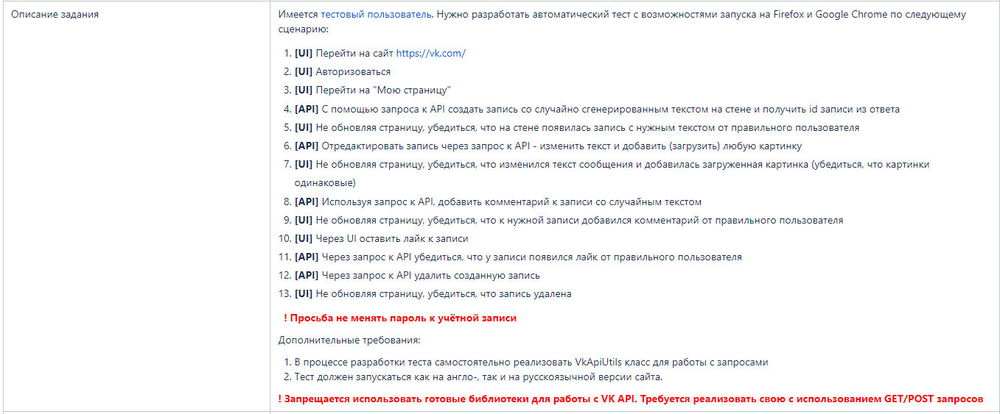

"VK + API" automated test

Test case:

1. [UI] Navigate to 'https://vk.com'
2. [UI] Authorization
3. [UI] Navigate to "My homepage"
4. [API] Create a post with randomly ge
5. [UI] Without refreshing the page, make sure that a post with the right text from the right user app
6. [API] Edit a post via an API request - change the text and upload any image.
7. [UI] Without refreshing the page, make sure that the text of the message has changed and the uploaded picture has been added (make sure that the pictures are the same).
8. [API] Using an API request, add a comment to a post with random text.
9. [UI] Without refreshing the page, make sure that a comment from the correct user has been added to the desired entry.
10. [UI] Like the post via UI.
11. [API] Through an API request, make sure that the post has a like from the correct user.
12. [API] Through an API request, delete the created post")
13. [UI] Without refreshing the page, make sure the post is deleted.

Additional requirements:

It is forbidden to use ready-made VK API libraries!
You need to independently implement the VkApiUtils class to work with requests
The test must run on both the English and Russian versions of the site

Data for vkApiRequestsData.json file:

"user_id": *** - vk user id

"tokenValue": "***" - access token

https://vkhost.github.io/ - Get access token

Data for vkAuthorizationData.json file:

"email": "***" - valid email or phone

"password": "***" - valid password
